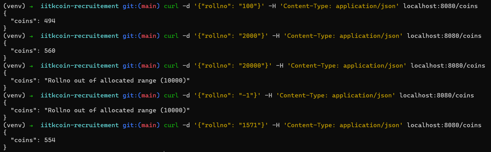
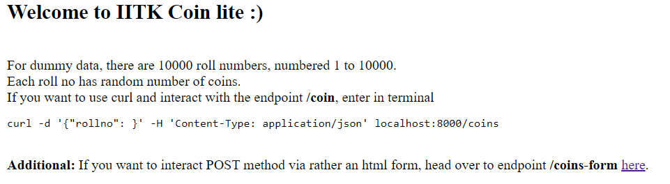
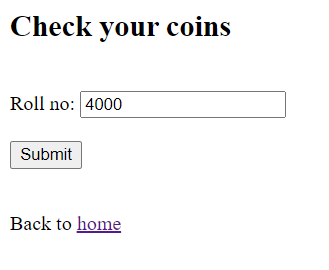
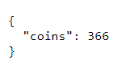

## Specifications

```
Language : python3
Framework: Flask
Dependencies:
- flask
- python-dotenv

Endpoints:
- '/' or '/index' or '/home' : Landing Page
- '/coins' : Task Endpoint
- '/coins-form' : Additional endpoint created for POST request via html form
```

## Installation

```
git clone <link-to-repo>
cd <repo>
python -m venv venv
source venv/bin/activate
pip install -r requirements.txt
```

## Execution

Head over to localhost:8080
```
flask run -p 8080
curl -d '{"rollno": "<rollno>"}' -H 'Content-Type: application/json' localhost:8080/coins
```

> _**NOTE**_: If you want to give a POST request via rather an html form, head over to endpoint /coins-form on browser.

## Gallery

### - CLI



### - GUI




